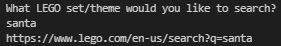
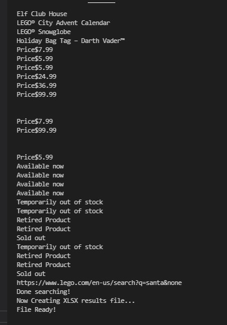
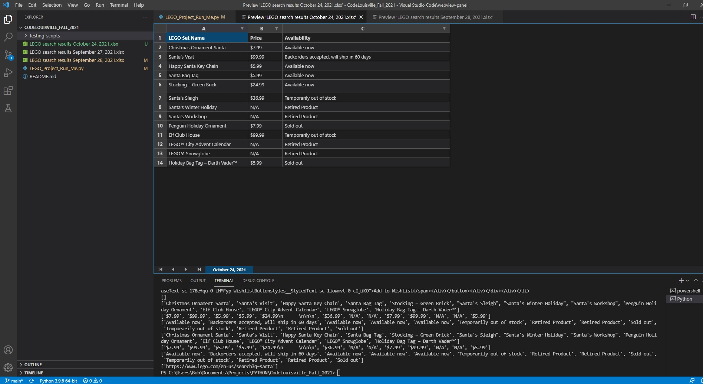
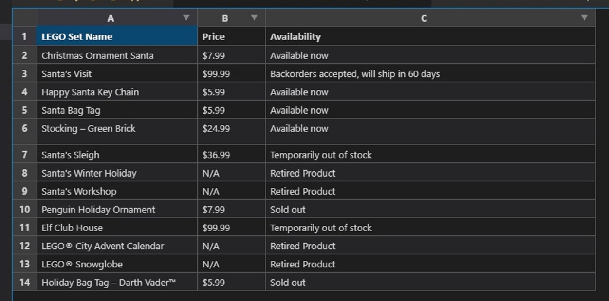

# Lego.com Item Search Scraper
   

# Table of Contents  

[About](https://github.com/avast-ye-matey/LEGO_Website_Search_Scraper#about) 
[What does this program do?](https://github.com/avast-ye-matey/LEGO_Website_Search_Scraper#whatdoesthisprogramdo) 
-- [Visual walkthrough](https://github.com/avast-ye-matey/LEGO_Website_Search_Scraper#visualwalkthrough) 
-- [Text walkthrough](https://github.com/avast-ye-matey/LEGO_Website_Search_Scraper#textwalkthrough) 
[Steps to run program](https://github.com/avast-ye-matey/LEGO_Website_Search_Scraper#stepstorunprgram) 
[Important note](https://github.com/avast-ye-matey/LEGO_Website_Search_Scraper#importantnote) 
[Tested versions](https://github.com/avast-ye-matey/LEGO_Website_Search_Scraper#testedversions) 
[Project Requirements](https://github.com/avast-ye-matey/LEGO_Website_Search_Scraper#projectrequirements) 
-- [Feature List Items Used](https://github.com/avast-ye-matey/LEGO_Website_Search_Scraper#featurelistitemsused) 
[Future Features](https://github.com/avast-ye-matey/LEGO_Website_Search_Scraper#futurefeatures)   

## About 
This program was originally meant to find what sets came out October 1st because weirdly a release calendar doesn't exist on their site. My focus needed to be on the functionality so I moved this purpose for a later feature. The results already return a lot of useful info already. I wanted to build a solid foundation because I was already having to build a powerful program for something that could be labeled a feature. Some code I already wrote is commented out for when I add the feature back. I also want to add a more functional search option for release timeframes beyond the static Oct. 1st. This program in its current state is meant to utilize the Excel file and not the terminal (beyond the initial user input). I use the terminal as a testing tool so it varies wildly from end results.    

## What does this program do? 

### Visual walkthrough  
1) Close-up of my terminal in Visual Studio.  
 
First line is the programs initial prompt.  
Second line is the user input.  
Third line is the URL that was created using the user input and the starting point for the scraper. 
2) Close-up of the terminal showing the terminal output. This isn't the final format. But it's something to watch to make sure it's working. 
 
4) Full screen screenshot of Visual Studio with `.xlsx` file being previewed.  
  
3) Zoomed in results. This is what to rely on instead of terminal output. 
  
	
	

### Text walkthrough  
This program takes a user input to scrape the LEGO website for sets, price, and availability using the user input. So lets say you want to see what LEGO Harry Potter sets  exist, if they're available (buy now, comming soon, retired, or back ordered), and how much they cost, well just type Harry Potter as your search input when asked. Once the program is done, the results are exported into an `.xlsx` (Excel) document and labeled with today's date and what search input was used. The functionality of the program is based on if you actually were searching the LEGO website. The program scrapes the search function as if you went directly to the Lego website and used the search function. Also the program relies on the Excel file for results and not the terminal (beyond the initial user input).    

## Steps to run program 
1) You will first need to install 3 packages-

`pip install requests`
[Documentation link](https://docs.python-requests.org/en/master/user/install/)

`pip install beautifulsoup4`
[Documentation link](https://www.crummy.com/software/BeautifulSoup/#Download)

`pip install XlsxWriter`
[Documentation link](https://xlsxwriter.readthedocs.io/getting_started.html)

2) Run-

`LEGO_Project_Run_Me.py`

3) Program will ask what do you want to search. Input anything you want to search on lego.com (santa, harry potter, and star wars are known working searches)

4) Be patient. Depending on connection, it could take a little bit to start returning values

5) Don't forget to check `.xlsx` document after program is done running!

6) **If you don't have Excel but have Visual Studio:** Add extension *Excel Viewer* by GrapeCity. Once downloaded, RIGHT-CLICK on file inside Visual Studio and select OPEN PREVIEW. If you double-click file it won't open properly in Visual Studio.   

## Important note 
<blockquote>
This program relies on the Excel file that is created after the program runs and not on the terminal output. The terminal is only currently used for the user to input the search term they wish to use to search the Lego website. I'm in-between functionalities with the program as I'm switching it to be user facing (web app) and NOT to be used in the terminal. I have cleaned up a lot of random terminal output I use for testing so the user can watch the results live but some random print functions may show.  

I leave myself a lot of notes and use the print function after almost every line to help me debug. I deleted most comments but some may still be in the code. Also most of the testing print functions are commented out, but still some testing output may find its way on the terminal. 
</blockquote>   

## Tested versions 

**Operating System:** 
Windows 10 Home 64-bit  

**Python:** 
version: 3.9.6  

**Packages:** 
requests --Version: 2.26.0 
XlsxWriter --Version: 3.0.1 
beautifulsoup4 --Version: 4.10.0  

**Tested search words:** 
santa 
harry potter 
batman 
star wars 
cigarette (for error referencing)   

## Project Requirements 
1) ✅ Project is uploaded to your GitHub repository and shows at minimum 5 separate commits
      - Using GitHub’s file uploader does not count as a check-in. You must upload via Git 

2) ✅ Project includes a README file that explains the following:
      - A one paragraph or longer description of what your project is about.
      - Relevant packages that need installed to run the project.
      - Which 3+ features you have included from the below lists to meet the requirements
      - Any special instructions required for the reviewer to run your project. (For example: “run python main.py” from the command line) 

3) ✅ Choose at least 3 items on the Features List and implement them in your project
      - We recommend you pick a 4th item (or more!) to add, just in case something goes wrong with one of your other items - 3 is only the minimum requirement   
      
 

### Feature List Items Used   
1) Create a class, then create at least one object of that class and populate it with data. The value of at least one object must be used somewhere in your code.
2) Create a dictionary or list, populate it with several values, retrieve at least one value, and use it in your program.
3) Create and call at least 3 functions or methods, at least one of which must return a value that is used somewhere else in your code. To clarify, at least one function should be called in your code, that function should calculate, retrieve, or otherwise set the value of a variable or data structure, return a value to where it was called, and use that value somewhere else in your code. For example, you could create a function that reads how many items there are in a text file, returns that value, and later uses that value to execute a loop a certain number of times.
4) (**May Need Mentor Approval**) Calculate and display data based on an external factor (ex: get the current date, and display how many days remaining until some event). 
	- *I pull the current date to add to final `xlsx` file name but don't use it to calculate anything.*
5) (**With Mentor Approval**) Other features can be added to this list with mentor or staff permission, but we want to see you stretch your skills, so you’ll want to pick something challenging.
	- *I export the result lists into a `xlsx` file*
### “Stretch” List Items Used   
6) Implement a “scraper” that can be fed a type of file or URL and pull information off of it. For example, a web scraper that lets you provide any website URL and it will find certain keywords on the page.   

## Future Features 
1) Make into a web app
2) Make output into alternate file extensions
3) Export results to Google Calendar
4) Create a searchable release calendar.
5) Add item links and pictures in output file

